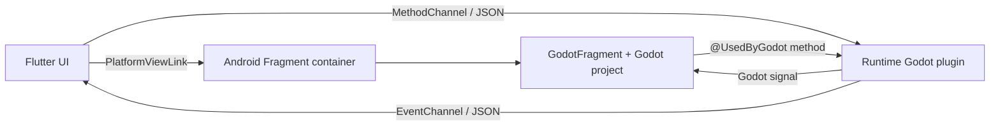

# Massage Flow — Flutter × Godot

An Android-first reference app in which Flutter owns navigation, product UI,
and session controls while Godot renders a focused interactive module inside a
normal Flutter screen. Godot is not launched as a second application.

## What is implemented

- Flutter Material 3 home and guided-session screens.
- An embedded `GodotFragment` exposed through a Flutter platform view using
  hybrid composition (appropriate for Godot's native render surface).
- A lifecycle-aware Kotlin host that enforces Godot's one-engine-per-process
  constraint.
- Bidirectional Flutter ↔ Kotlin ↔ Godot communication using JSON envelopes.
- A small Godot 4 reference scene that responds to configure, pause, resume,
  and reset commands and reports interactions back to Flutter.
- Dart unit/widget tests and a CI workflow for analyze, test, and Android build.

## Architecture



The Android Gradle build adds `godot_project/` directly as an asset source.
Consequently, `project.godot` is packaged at the APK asset root exactly where
the embedded engine expects it.

## Run on Android

Requirements: Flutter 3.47.x, Android SDK 36.1, Java 17, and an Android device or
emulator with API 24+.

The checked-in Android configuration is pinned to Flutter 3.47.4, Godot 4.7.2,
AGP 9.1.0, Gradle 9.3.1, and Kotlin 2.4.0.

```sh
flutter pub get
flutter analyze
flutter test
flutter run
```

The first Android build downloads the pinned Godot Android AAR and is therefore
larger and slower than a typical Flutter-only build.

## Use the real Godot project

The repository currently contains a deliberately small reference project
because no external Godot project was available in the supplied workspace.
To replace it:

1. Copy the contents of the real project into `godot_project/` so that
   `godot_project/project.godot` remains the project root.
2. Match `godotVersion` in `android/gradle.properties` to the editor version.
3. Preserve or adapt the bridge contract documented in
   `docs/godot-integration.md`.
4. If the project uses GDExtension or Android plugins, include their Android
   libraries for every supported ABI and add their Maven/AAR dependencies to
   `android/app/build.gradle.kts`.

Editor-only `.godot/` state and the Godot Android build template are ignored.
For direct asset embedding, commit required `.godot/imported/` artifacts as well
as source scenes, scripts, shaders, and source assets; alternatively package a
PCK in CI.

## Production notes

- Replace the sample application ID and debug release signing before shipping.
- Test navigation into and out of the Godot screen repeatedly on physical
  devices; GPU and activity lifecycle behavior varies by vendor.
- Keep one Godot platform view mounted at a time. The native host retains that
  engine across session-screen navigation and rejects multi-instance mounting.
- See `docs/godot-integration.md` for the message schema, troubleshooting, and
  extension points.
